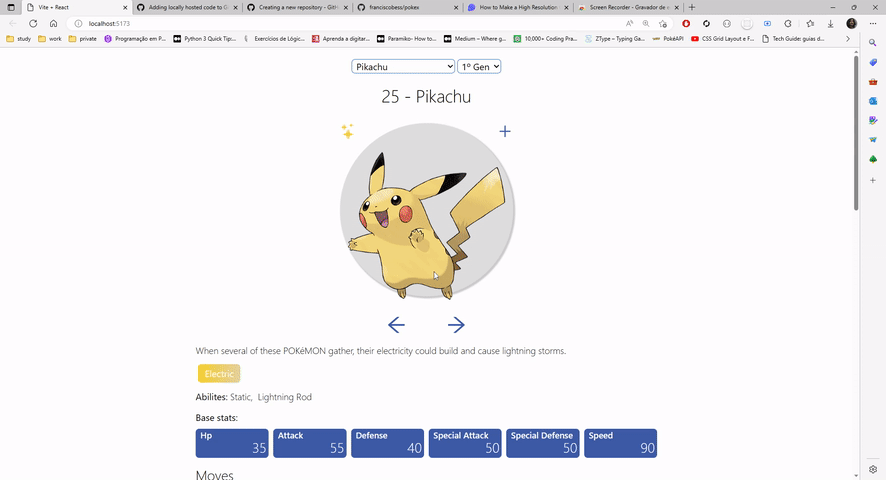

# Pokex
Pokex is a pokedex clone created using React and Tailwind. 

The pokemon data are fetched from PokeAPI [a link](https://pokeapi.co/).

This application allows the user to search for pokemon information like decription, types, abilities, etc.

The user also can view the pokemon shiny forms and create a team with the monsters that he likes most.

